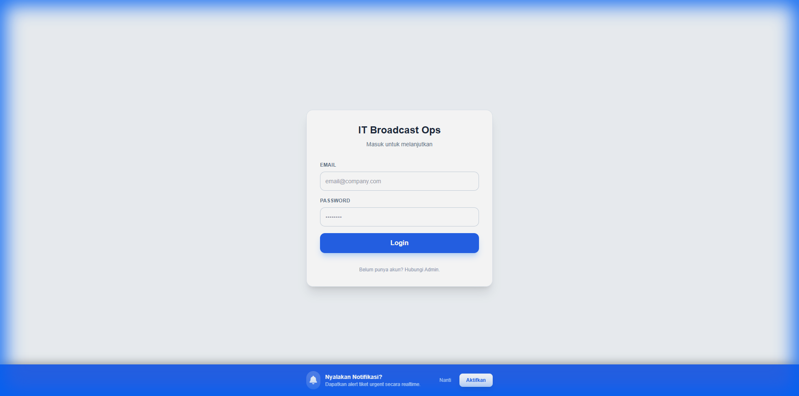
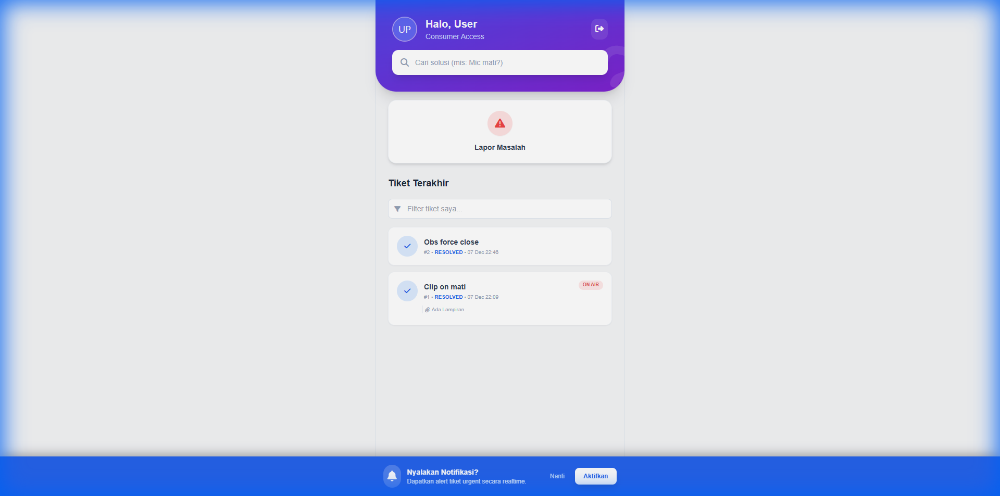

# User Manual: Consumer (Pengguna Umum)

## Pendahuluan
Role **Consumer** adalah pengguna umum (karyawan non-IT) yang menggunakan sistem untuk melaporkan masalah teknis dan melihat pengumuman atau artikel bantuan.

## Login
Untuk mengakses sistem, buka halaman login dan masukkan email serta password Anda.

## Dashboard Utama
Setelah login, Anda akan diarahkan ke **Dashboard**. Di sini Anda dapat melihat:
1.  **Pengumuman Penting**: Informasi terbaru dari tim IT.
2.  **Statistik Saya**: Jumlah tiket yang Anda buat (Open/Closed).
3.  **Tiket Terakhir**: Daftar laporan masalah yang baru saja Anda kirim.

## Membuat Tiket Baru
1.  Klik tombol **"Buat Tiket Baru"** di sidebar atau dashboard.
2.  Isi formulir dengan detail lokasi, kategori masalah, dan deskripsi.
3.  Klik **Submit**.

## Mencari Bantuan (Big Book)
Anda dapat mencari panduan solusi mandiri di kolom pencarian "Cari solusi...". Artikel yang relevan akan muncul untuk membantu Anda menyelesaikan masalah ringan tanpa perlu menunggu teknisi.
