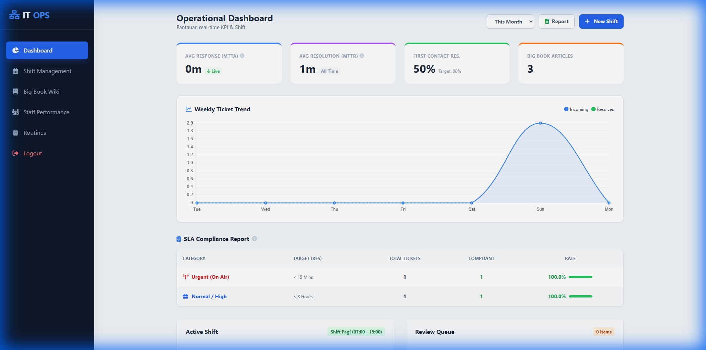
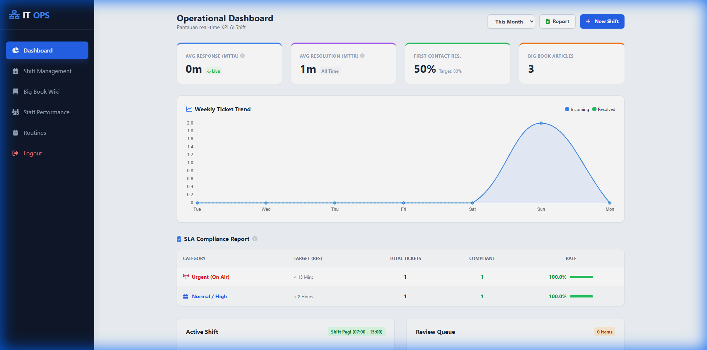

# User Manual: Manager

## Pendahuluan
Role **Manager** ditujukan untuk supervisor atau kepala departemen yang memantau kinerja tim IT dan kesehatan sistem operasional.

## Dashboard Monitoring
Dashboard Manager menyajikan data analitik real-time:
1.  **SLA Compliance**: Persentase kepatuhan terhadap target layanan.
2.  **MTTA (Mean Time To Acknowledge)**: Kecepatan respon teknisi.
3.  **MTTR (Mean Time To Resolve)**: Kecepatan penyelesaian masalah.
4.  **Health Score**: Skor kesehatan sistem keseluruhan.

### Grafik & Laporan
Anda dapat memantau tren kinerja melalui grafik batang dan diagram lingkaran untuk melihat distribusi masalah berdasarkan kategori atau waktu.

## Manajemen Rutinitas
Manager dapat membuat dan mengedit **Template Rutinitas** (Checklist Maintenance).
-   Atur jadwal (Cron Schedule).
-   Tentukan item checklist yang harus diperiksa Staff.
-   Monitor kepatuhan checklist harian.
