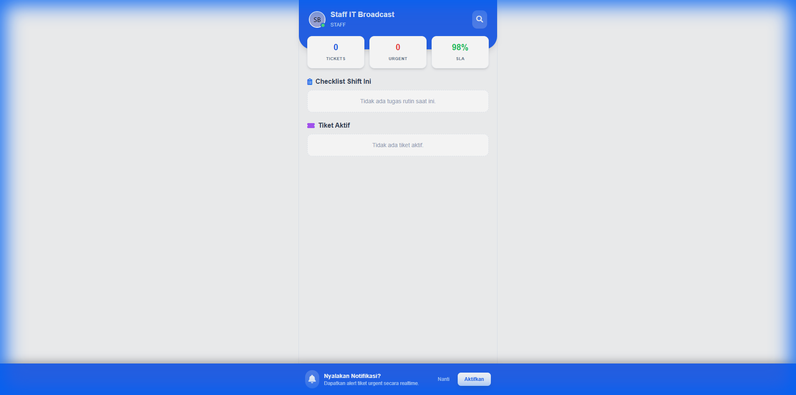
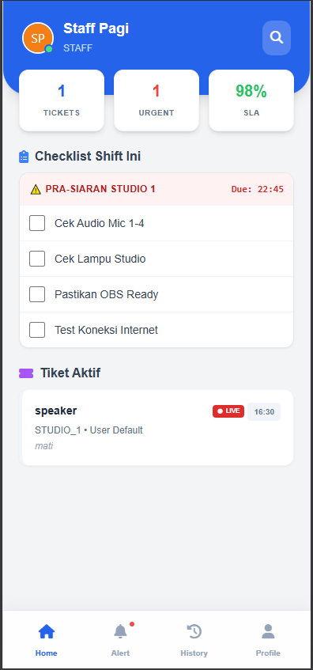
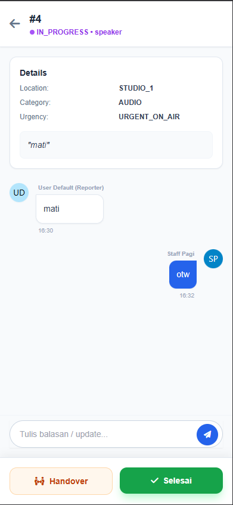
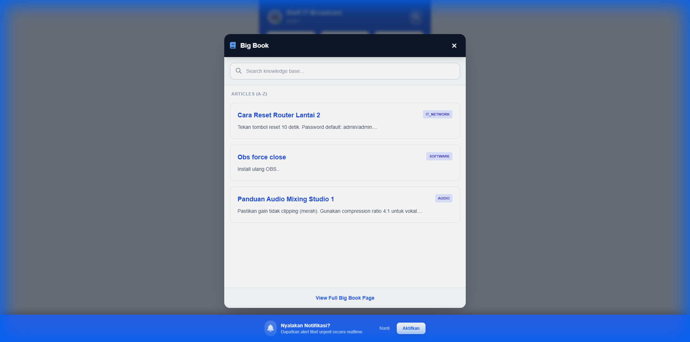

# User Manual: IT Staff

## Pendahuluan
Role **Staff** digunakan oleh teknisi IT untuk menerima, memproses, dan menyelesaikan tiket masalah, serta mengelola artikel pengetahuan (Big Book).

## Dashboard Staff
Dashboard memberikan ringkasan tugas harian Anda, termasuk:
-   **Tiket Masuk**: Laporan baru yang belum ditangani.
-   **Tugas Rutin**: Checklist harian (maintenance) yang harus dikerjakan.
-   **Tiket Saya**: Tiket yang sedang Anda kerjakan (In Progress).

## Manajemen Tiket
### Daftar Tiket
Anda dapat melihat daftar tiket yang masuk di bagian bawah dashboard atau menu Tiket. Gunakan filter untuk mencari tiket berdasarkan status atau urgensi.

### Detail Tiket & Respon
Klik pada judul tiket untuk melihat detailnya. Di halaman ini Anda dapat:
1.  **Mengirim Balasan**: Chat dengan pelapor.
2.  **Ubah Status**: Set ke `IN_PROGRESS` saat mulai bekerja, `RESOLVED` saat selesai.
3.  **Unggah Foto**: Bukti perbaikan.

## Big Book (Knowledge Base)
Big Book adalah kumpulan artikel solusi. Staff dapat:
-   Membuat artikel baru berdasar pengalaman perbaikan.
-   Mengubah status tiket menjadi artikel ("Convert to Article").
-   Mencari panduan teknis yang sudah ada.

